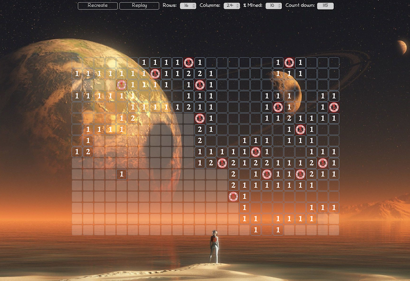

# Minesweeper

- UI logic implemented using vanilla JS
- Game logic is implemented in Rust and attached as WebAssembly pakage
  
  Check out logic implementation here: https://github.com/olekas/minesweeper-on-rust
 


# Web + Rust + WebAssembly 
This game is developed in attempt to learn and practice more in using Rust in front end web development. It was inspired by Game of life example which can be found here: https://rustwasm.github.io/docs/book/game-of-life/setup.html. Below setup instructions in general repeat Game of life docs but less detailed.

# Prerequisite 
1. You will need the standard Rust toolchain, including rustup, rustc, and cargo:
  https://www.rust-lang.org/tools/install
2. wasm-pack: 
  https://rustwasm.github.io/wasm-pack/installer/
3. npm: 
  https://www.npmjs.com/get-npm

# Setup & run

1. Clone repo with recursion to grab Rust submodule 
  ```bash
  git clone --recurse-submodules git@github.com:olegkas4/minesweeper-on-rust-wasm-ui.git
  ```
3. Install necessary nodejs packages
  ```bash
  cd minesweeper-on-rust-wasm-ui
  npm install
  ```
4. Build rust project into wasm package, it will create wasm folder under minesweeper-on-rust-wasm-ui folder and place there rust code converted to WebAssembly as nodejs package
  ```bash
  npm run wasm
  ```

5. Start webpack dev service
  ```bash
  npm run start
  ```
6. Open browser and go to webpack dev service url. URL can be found in webpack start logs, look for a line like below:
```
ℹ ｢wds｣: Project is running at http://localhost:8081/
```
  
# Game controls

When open in browser, game creates a default mine field based on initial cell size (x2) and trying to cover 70% of height and width of play screen area with 40% of cells mined.
- to set/remove cell flag use single mouse click
- to dig/uncover a cell use mouse double click

Controls on top right side of the game window show current game information like number of columns and rows, percentage of mined cells, number of cells left to uncover. Replay button in same control group allows to replay the game with the same set of mined cells

Control on bottom right allow to define configuration for a new game. Here you can define:
- number of columns and rows (values between 5 and 1000)
- percentage of mined cells (value between 10 and 90 percents)
- "Fit screen" buttons set correspondingly number of columns and rows to fit screen width and height based on selected cell size value.
- Having all settings ready press Create button to build new game field and/or re-shuffle mines

Cell Size setting at the middle right allows to change cell size from 1 to 5 in REMs. It can be changed at any moment and causes re-alinement of game grid according to the new cell size. It does not change current game state
